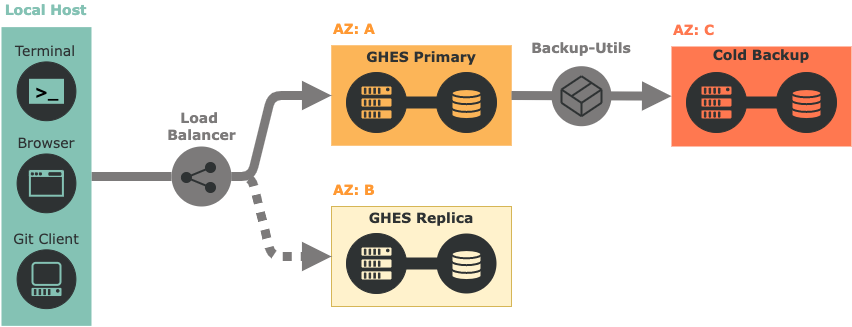

# 🎯 Purpose

The purpose of this guide is to give you the basic information you need to get going with GitHub.  This guide is intended to be used for GitHub in a common configuration. It is not the end all and be all of the information available to help you succeed with GitHub, but is a curated list of the following GitHub resources as well as other public sources of information:

- [GitHub User Help Docs](https://help.github.com/)

- [GitHub Enterprise Help Docs](https://help.github.com/enterprise)

- [GitHub Services Resources](https://services.github.com/on-demand/resources/)

- [GitHub Resources](https://resources.github.com/)

- [GitHub Guides](https://guides.github.com/)

- [GitHub Videos](https://www.youtube.com/user/GitHubGuides/)

## :octocat: The GitHub Platform

GitHub is more than "version control"; it is an all-inclusive and unified collaboration platform:

 

## ⏩ Get Going

- 💻 [Get Distributed](#-get-distributed)
- ⚙️ [Get Installed *](#️-get-installed-)
- 🔧 [Get Configured *](#-get-configured-)
- 📁 [Get Organized](#-get-organized)
- :key: [Get Access](#key-get-access)
- :nut_and_bolt: [Get Setup](#nut_and_bolt-get-setup)
- 🌊 [Get Flowing](#-get-flowing)
- ✅ [Get Managing](#-get-managing)
- :books: [Get Documented](#books-get-documented)
- 🔗 [Get Integrated](#-get-integrated)
- ⬆️ [Get Upgraded *](#️-get-upgraded-)
- 📢 [Get Informed](#-get-informed)
- 🆘 [Get Help](#-get-help)
- 🌐 [Get Open Sourcing](#-get-open-sourcing)

&#42; ENTERPRISE SERVER ONLY

## 💻 Get Distributed

Get familiarized with why modern distributed version control is an improvement over traditional centralized version control

- [About Version Control](https://git-scm.com/book/en/Getting-Started-About-Version-Control) (Distributed vs. Centralized)

- [Git Basics](https://git-scm.com/book/en/Getting-Started-Git-Basics) (Snapshots vs. Differences)

- [Intro to Distributed Version Control](https://betterexplained.com/articles/intro-to-distributed-version-control-illustrated/) (vs. Centralized Version Control)

## ⚙️ Get Installed *

Get your GitHub Enterprise Server instance installed and on a virtualization platform of your choice

- [Provisioning and installation](https://docs.github.com/en/enterprise-server@3.7/admin/installation)

## 🔧 Get Configured *

Get your GitHub Enterprise Server instance configured with the right authentication and backup infrastructure for your environment

- [Web-based management console](https://docs.github.com/en/enterprise-server@3.7/admin/configuration/configuring-your-enterprise/accessing-the-management-console)

- [Authenticating users for your GitHub Enterprise Server instance](https://docs.github.com/en/enterprise-server@3.7/admin/identity-and-access-management/managing-iam-for-your-enterprise/about-authentication-for-your-enterprise)

- [High Availability configuration](https://docs.github.com/en/enterprise-server@3.7/admin/enterprise-management/configuring-high-availability/about-high-availability-configuration)

- [Backups and disaster recovery](https://docs.github.com/en/enterprise-server@3.7/admin/configuration/configuring-your-enterprise/configuring-backups-on-your-appliance)

- [Using GHES with a load balancer](https://docs.github.com/en/enterprise-server@3.7/admin/configuration/configuring-network-settings/using-github-enterprise-server-with-a-load-balancer)

- [About Geo-replication](https://docs.github.com/en/enterprise-server@3.7/admin/enterprise-management/configuring-high-availability/about-geo-replication)

- Recommended architecture:

    

## 📁 Get Organized

Get your people and code organized to optimize discoverability and reuse

- [Organizing People for Successful Collaboration](https://vimeo.com/179075921/a774e76f4f) (5 min video)

  - [Collaborating with groups in **organizations**](https://help.github.com/articles/collaborating-with-groups-in-organizations/)

  - [Organizing members into **teams**](https://help.github.com/articles/organizing-members-into-teams/)

  - [Creating **repositories**](https://help.github.com/articles/creating-a-repository-on-github/)

  - e.g. @ [GitHub Desktop](https://github.com/desktop)

- [Configuring GitHub for Collaboration and Compliance](https://docs.google.com/presentation/d/1UNAW-VKdCUHAAl2zi0Tksid-sEs2VFr_0M_tidslERI/edit?usp=sharing) (Presentation from [@elstudio](https://github.com/elstudio))

- Why organization structure matters

  - The immediate instinct may be to create an organization for every project or department at your company, leading to many divided groups that function in GitHub as siloes

  - This may seem like a good way to manage permissions and reduce noise, but it’s not always the ideal strategy

  - In fact, it is detrimental to cross-team collaboration and can result in administrative headaches down the line

  - Instead of creating many organizations and siloing users, we suggest using one or few organizations for shared ownership of repositories and making use of teams to segment users within those organizations -- e.g.: [Google](https://github.com/google); [Microsoft](https://github.com/Microsoft)

    

## :key: Get Access

Get access and permissions in place to satisfy your security policies

- [Permission levels for an organization](https://help.github.com/articles/permission-levels-for-an-organization/)

- [Repository permission levels for an organization](https://help.github.com/articles/repository-permission-levels-for-an-organization/)

- [Permission levels for a user account repository](https://help.github.com/articles/permission-levels-for-a-user-account-repository/)

- [Administering a repository](https://help.github.com/categories/administering-a-repository/)

  - [Managing a branch protection rule](https://docs.github.com/en/repositories/configuring-branches-and-merges-in-your-repository/defining-the-mergeability-of-pull-requests/managing-a-branch-protection-rule)

  - [Troubleshooting required status checks](https://docs.github.com/en/repositories/configuring-branches-and-merges-in-your-repository/defining-the-mergeability-of-pull-requests/troubleshooting-required-status-checks)

  - [About branch restrictions](https://help.github.com/articles/about-branch-restrictions/)

## :nut_and_bolt: Get Setup

Get Git and GitHub setup for the first time

- [Getting started with GitHub](https://help.github.com/categories/setup/)

- [Connecting to GitHub with SSH](https://docs.github.com/en/authentication/connecting-to-github-with-ssh)

- [GitHub Desktop](https://desktop.github.com/): Extend your GitHub workflow beyond your browser

- [Atom](https://atom.io/): A customizable text editor

- [GitHub for Atom](https://github.atom.io/): Git and GitHub integration inside Atom

## 🌊 Get Flowing

Get your work flowing to the right people and reviewed by the right people

- [Understanding the GitHub Flow](https://guides.github.com/introduction/flow/)

- [About branches](https://help.github.com/articles/about-branches/)

- [About commits](https://help.github.com/categories/commits/)

- [About pull requests](https://docs.github.com/en/pull-requests/collaborating-with-pull-requests/proposing-changes-to-your-work-with-pull-requests/about-pull-requests)

- [About pull request reviews](https://docs.github.com/en/pull-requests/collaborating-with-pull-requests/reviewing-changes-in-pull-requests/about-pull-request-reviews)

- [About pull request merges](https://docs.github.com/en/pull-requests/collaborating-with-pull-requests/incorporating-changes-from-a-pull-request/about-pull-request-merges)

- [Mentioning users and teams](https://docs.github.com/en/get-started/writing-on-github/getting-started-with-writing-and-formatting-on-github/basic-writing-and-formatting-syntax#mentioning-people-and-teams)

- e.g. @ [Electron](https://github.com/electron/electron/pull/11658)

## ✅ Get Managing

Get your work and projects managed from start to finish

- Describing and discussing work:

  - [Tracking your work with issues](https://docs.github.com/en/issues/tracking-your-work-with-issues/about-issues)

  - [Labeling issues and pull requests](https://docs.github.com/en/actions/managing-issues-and-pull-requests/adding-labels-to-issues)

  - [Filtering and searching issues and pull requests](https://docs.github.com/en/issues/tracking-your-work-with-issues/filtering-and-searching-issues-and-pull-requests)

  - e.g. @ [Atom](https://github.com/atom/atom/issues)

- Planning and tracking work:

  - [Tracking progress on your project board](https://docs.github.com/en/issues/organizing-your-work-with-project-boards/tracking-work-with-project-boards/tracking-progress-on-your-project-board)

  - [Creating and editing milestones for issues and pull requests](https://docs.github.com/en/issues/using-labels-and-milestones-to-track-work/creating-and-editing-milestones-for-issues-and-pull-requests)

  - [Releasing projects on GitHub](https://docs.github.com/en/repositories/releasing-projects-on-github))

  - e.g. @ [Kubernetes](https://github.com/kubernetes/kubernetes/projects)

## :books: Get Documented

Get information about your work and projects documented to share right next to your code

- [READMEs](https://docs.github.com/en/repositories/managing-your-repositorys-settings-and-features/customizing-your-repository/about-readmes) -- e.g.&nbsp; : &nbsp;[Spotify](https://github.com/spotify/luigi/blob/master/README.rst)&nbsp; ; &nbsp;[Docker](https://github.com/docker/docker.github.io/blob/master/README.md)

- [Wikis](https://docs.github.com/en/communities/documenting-your-project-with-wikis) -- e.g.&nbsp; : &nbsp;[D3](https://github.com/d3/d3/wiki)&nbsp; ; &nbsp;[Netflix Hystrix](https://github.com/Netflix/Hystrix/wiki)&nbsp; ; &nbsp;[Projects with great wikis](https://github.com/showcases/projects-with-great-wikis)

- [GitHub Pages](https://docs.github.com/en/pages/getting-started-with-github-pages) -- e.g.&nbsp; : &nbsp;[Facebook React Native](https://facebook.github.io/react-native/)&nbsp; ; &nbsp;[Twitter](http://twitter.github.io/)&nbsp; ; &nbsp;[Best Buy](https://bestbuyapis.github.io/api-documentation/)&nbsp; ; &nbsp;[GitHub Pages examples](https://github.com/showcases/github-pages-examples)

## 🔗 Get Integrated

Get integrated with the rest of your development pipeline

- [Products that integrate with the GitHub platform](https://github.com/works-with)

- [GitHub Services Integration](https://github.com/github/github-services)

- [GitHub Marketplace](https://github.com/marketplace)

- [GitHub REST API](https://docs.github.com/en/rest)

- [GitHub GraphQL API](https://docs.github.com/en/graphql)

## 📢 Get Informed

Get informed on what's new with GitHub

- [GitHub Blog](https://github.com/blog/)

- [GitHub Engineering](https://githubengineering.com/)

- [The State of the Octoverse](https://octoverse.github.com/)

<!-- textlint-disable -->
- [@github on Twitter](https://twitter.com/github)
<!-- textlint-enable -->

## ⬆️ Get Upgraded *

Get your GitHub Enterprise Server instance upgraded to the latest release

- [Upgrading GitHub Enterprise Server](https://docs.github.com/en/enterprise-server@3.5/admin/enterprise-management/updating-the-virtual-machine-and-physical-resources/upgrading-github-enterprise-server)

- [GitHub Enterprise Server Releases](https://enterprise.github.com/releases)

## ℹ️ Get Enabled

Get enabled on the basics of Git and GitHub

- [Git and GitHub learning resources](https://docs.github.com/en/get-started/quickstart/git-and-github-learning-resources)

- [On Demand Training](https://services.github.com/on-demand/)&nbsp; : &nbsp;[GitHub Learning Resources](https://services.github.com/on-demand/resources/)&nbsp; ; &nbsp;[Learning Path](https://services.github.com/on-demand/resources/learning-path/)

- [GitHub Guides @ YouTube](https://www.youtube.com/user/GitHubGuides)&nbsp; : &nbsp;[Git Basics • Training](https://www.youtube.com/playlist?list=PLg7s6cbtAD165JTRsXh8ofwRw0PqUnkVH)&nbsp; ; &nbsp;[Git and GitHub with Briana Swift](https://www.youtube.com/playlist?list=PLg7s6cbtAD17Gw5u8644bgKhgRLiJXdX4) (videos)

## 🆘 Get Help

Get dedicated help from GitHub to support your continued success

- [GitHub Success Team](https://github.com/enterprise/contact?utm_campaign=sales-email)&nbsp; | &nbsp;[GitHub Professional Services](https://services.github.com/)

- [GitHub.com Support](https://github.com/support)&nbsp; | &nbsp;[GitHub Enterprise Support](https://enterprise.github.com/support)

Get help from the GitHub community

- [GitHub Community Forum](https://github.community/)&nbsp; | &nbsp;[GitHub Platform Forum](https://platform.github.community/)

## 🌐 Get Open Sourcing

Get collaborating with the Open Source community

- [The largest open source community in the world](https://github.com/open-source)

- [Open Source Guides](https://opensource.guide/)

- [Explore GitHub](https://github.com/explore)

- [Open source organizations](https://github.com/showcases/open-source-organizations) -- e.g.:

  - [Open Source at Microsoft](https://opensource.microsoft.com/)&nbsp; : &nbsp;[TypeScript](https://github.com/Microsoft/TypeScript)&nbsp; ; &nbsp;[Azure Docs](https://github.com/MicrosoftDocs/azure-docs)

  - [Capital One Open Source](https://developer.capitalone.com/open-source/)

  - [Develop with Deere](https://developer.deere.com/)

  - [Spotify](https://spotify.github.io/)

  - [Mapbox](https://github.com/mapbox)
